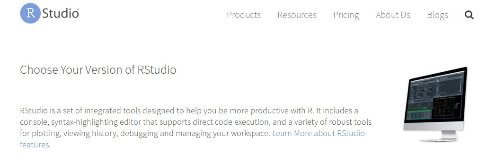
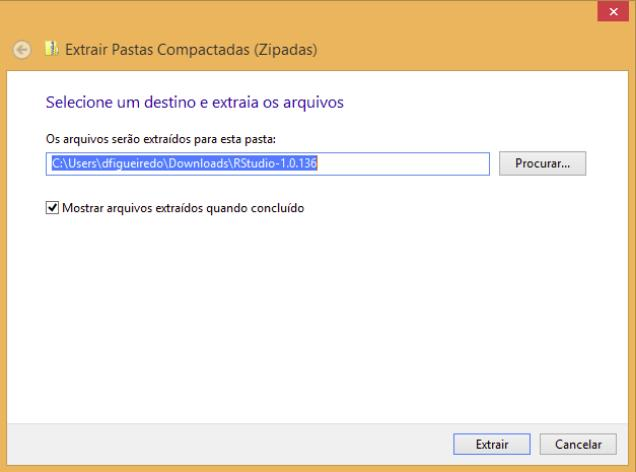

# 1) Instalando o R

## Windows

* Acesse o [link](https://cran.r-project.org/bin/windows/base/) e aparecerá a tela abaixo

```{r echo=FALSE, fig.align='center', out.width="90%"}

```
---
class:  center, middle
* Você pode salvar o arquivo em qualquer pasta, aqui vamos salvar na pasta Downloads
```{r echo=FALSE, fig.align='center', out.width="60%"}

```
Fonte: [Curso-R](https://www.curso-r.com/material/instalacao/)

---
class:  center, middle
* Clique no arquivo duas vezes com o botão esquerdo. Ele pedirá para você selecionar a linguagem da instalação. Escolha um idioma e clique em “OK”.

* Clique em “Avançar” até chegar na tela da imagem abaixo. Nessa etapa, você precisará escolher a pasta de instalação. Se você escolher um local que não está dentro da pasta do seu usuário, você precisará de acesso de administrador. Se escolher uma pasta dentro do seu usuário (como na imagem abaixo), não precisará.

```{r echo=FALSE, fig.align='center', out.width="70%"}
knitr::include_graphics("programa_instalacao_windows.jpeg")
```
Fonte: [Curso-R](https://www.curso-r.com/material/instalacao/)

---
class:  center, middle
* Clique em avançar até chegar na tela abaixo:

```{r echo=FALSE, fig.align='center', out.width="70%"}
knitr::include_graphics("finalizar_windows.jpeg")
```
Fonte: [Curso-R](https://www.curso-r.com/material/instalacao/)

Pronto! você já tem o **R** na sua máquina!

---
## Linux
* Acesse esse [link](https://cran.r-project.org//) selecione Linux, você direcionado para uma página com a figura abaixo. 

```{r echo=FALSE, fig.align='center', out.width="70%"}

```
* Escolha com a sua distribuição de Linux e siga as instruções para instalação

---
## MAC
class:  center, middle
* Acesse esse [link](https://cran.r-project.org//) selecione MAC, você direcionado para uma página com a figura abaixo. 

```{r echo=FALSE, fig.align='center', out.width="100%"}
knitr::include_graphics("instalacao_mac.jpeg")
```
* Escolha a versão do seu sistema operacional MAC OSX e siga as instruções para instalação

---
# 2) Instalando o R-Studio
## Windows
* Acesse o [link](https://www.rstudio.com/products/rstudio/download/)
```{r echo=FALSE, fig.align='center', out.width="60%"}

```
* Role a tela até o final para encontrar as seguintes opções:
---
class:  center, middle
a. Se você tiver acesso administrador, baixe a versão que está na lista de Installers for *Supported Platforms*. Em seguida a instalação será bem simples: fazer o download, abrir o instalador e seguir as instruções, clicando no botão “Avançar”.

```{r echo=FALSE, fig.align='center', out.width="60%"}
knitr::include_graphics("installer.jpeg")
```

---
class:  center, middle
b. Se você não tiver acesso de administrador, faça o download da versão que está na lista Zip/Tarballs. 
```{r echo=FALSE, fig.align='center', out.width="60%"}

```
---
class:  center, middle
Se você for o **administrador**

2a. Clique duas vezes no arquivo que você baixou da página do RStudio (ver imagem abaixo) e siga as instruções de instalação.

```{r echo=FALSE, fig.align='center', out.width="60%"}

```
Fonte: [Curso-R](https://www.curso-r.com/material/instalacao/)

---
class:  center, middle
Se você **não** for o **administrador**

2b. Se você não for administrador, você deve ter feito o download de um arquivo do tipo .zip, que contém o código do RStudio. É o arquivo selecionado na imagem abaixo.

```{r echo=FALSE, fig.align='center', out.width="60%"}

```
Fonte: [Curso-R](https://www.curso-r.com/material/instalacao/)
---
class:  center, middle
* Clique com o botão direito neste arquivo e depois em Extrair Tudo conforme a imagem.

```{r echo=FALSE, fig.align='center', out.width="60%"}

```
Fonte: [Curso-R](https://www.curso-r.com/material/instalacao/)
---
class:  center, middle
* Você verá uma tela como a imagem a seguir. Não mude nada e clique em extrair. Espere o Windows completar a extração.

```{r echo=FALSE, fig.align='center', out.width="60%"}

```
---
class:  center, middle
* Agora, na pasta Downloads, a pasta que deixamos como local de extração, você terá uma pasta chamada: **RStudio-1.0.136**. Abra essa pasta e entre na subpasta com nome **bin**.

* Procure pelo arquivo chamado rstudio e clique duas vezes. Isso abrirá o RStudio. ***Sugestão:*** fixe o programa na barra de tarefas para não ter que ficar procurando nessa pasta sempre que quiser abri-lo.

**Observação:**  se você excluir a pasta que extraímos, o RStudio irá parar de funcionar.

---
## Linux
class:  center, middle
* Acesse o [link](https://www.rstudio.com/products/rstudio/download/)
```{r echo=FALSE, fig.align='center', out.width="100%"}

```

---
class:  center, middle
* Role a tela até o final para encontrar as opções de sistema operacional
```{r echo=FALSE, fig.align='center', out.width="60%"}

```
* Escolha o seu sistema operacional e siga as instruções para instalação
---
class:  center, middle
* Dê ok e siga as instruções que aparecerem na tela 
```{r echo=FALSE, fig.align='center'}
knitr::include_graphics("linux_rstudio.jpeg")
```
---
## MAC
class:  center, middle
* Acesse o [link](https://www.rstudio.com/products/rstudio/download/)

```{r echo=FALSE, fig.align='center', out.width="100%"}

```
---
class:  center, middle
* Dê ok e siga as instruções que aparecerem na tela 

```{r echo=FALSE, fig.align='center', out.width="100%"}

```
---
# Fontes
* [Curso-R](https://www.curso-r.com/material/instalacao/)
* [R](https://www.r-project.org/)
* [R-Studio](https://www.rstudio.com/)